# 🚨 Multimodal Threat Detection System


## 📖 Project Overview

The **Multimodal Threat Detection System** is a real-time surveillance solution designed to identify distress signals using two parallel inputs:
1.  **Audio Intelligence:** Detects specific distress keywords (e.g., "Help") using a CNN trained on Mel-Spectrograms.
2.  **Visual Intelligence:** Recognizes specific hand gestures using MediaPipe pose estimation.
3.  **Automated Response:** Triggers instant SMS alerts to emergency contacts via the Twilio API upon confirmed detection.

---

## 🧠 System Architecture

```mermaid
graph LR
    A[Start] --> B{Select Mode}
    
    %% Audio Path
    B -->|Audio| C[🎤 Mic Input]
    C --> D[CNN Model]
    D --> E{Threat?}

    %% Vision Path
    B -->|Vision| F[📷 Webcam]
    F --> G[Gesture Model]
    G --> E

    %% Alert Path
    E -- Yes --> H[🚨 Cooldown Check]
    H -- Pass --> I[📲 Twilio SMS]
```



---

## 🛠️ Tech Stack
* **Vision:** MediaPipe (Hand Tracking) + TensorFlow (Gesture Classification).
* **Audio:** Librosa (Spectrogram generation) + CNN (Keyword Spotting).
* **Alerts:** Twilio REST API for real-world SMS integration.
* **Logic:** Custom Python dashboard with Threading and Cooldown timers.

---

## ⚙️ Installation & Setup

### 1. Clone the Repository
```bash
git clone [https://github.com/YOUR_GITHUB_USERNAME/Multimodal-Threat-Detection.git](https://github.com/YOUR_GITHUB_USERNAME/Multimodal-Threat-Detection.git)
cd Multimodal-Threat-Detection
```

### 2. Install Dependencies
```bash
pip install -r requirements.txt
```

### 3. Configure API Keys
For security, API keys are not uploaded to GitHub. You must configure them locally.
1.  Rename `keys_sample.py` to `keys.py`.
2.  Add your Twilio credentials inside `keys.py`:
    ```python
    ACCOUNT_SID = "ACxxxxxxxx..."
    AUTH_TOKEN = "xxxxxxxxxx..."
    TWILIO_PHONE = "+1555..."
    YOUR_PHONE = "+91..."
    ```

---

## 🚀 How to Run

Execute the main dashboard:
```bash
python main.py
```

### Modes
1.  **Audio Surveillance (Option 1):**
    * System listens for the keyword **"Help"**.
    * Upon detection, an SMS is sent.

2.  **Visual Surveillance (Option 2):**
    * System activates the webcam.
    * Show the **Three Fingers** gesture (Class: `three_2`) to trigger the distress signal.
    * A Red Bounding Box will appear, and an SMS will be sent.

---

## 📂 Project Structure

```text
Multimodal-Threat-Detection/
│
├── main.py                   # Central Control Dashboard
├── keys_sample.py            # Template for API credentials
├── requirements.txt          # Dependencies list
├── README.md                 # Documentation
│
├── audio_module/             # Audio Intelligence
│   ├── kws.py                # Audio inference logic
│   └── my_kws_model_0.h5     # Pre-trained KWS Model
│
└── vision_module/            # Visual Intelligence
    ├── gesture_recognizer.py # Gesture inference logic
    ├── gesture_model_multiclass.h5 # Pre-trained Vision Model
    └── class_labels.txt      # Class mappings
```

## 👨‍💻 Author

**Mikkilineni Sai Krishna Nithin**

* **GitHub:** [View My Projects](https://github.com/nithin-mikkilineni)
* **LinkedIn:** [Connect on LinkedIn](https://www.linkedin.com/in/sai-krishna-nithin-mikkilineni-544a86255)

---
*This project was built for educational purposes as part of my final year coursework.*
